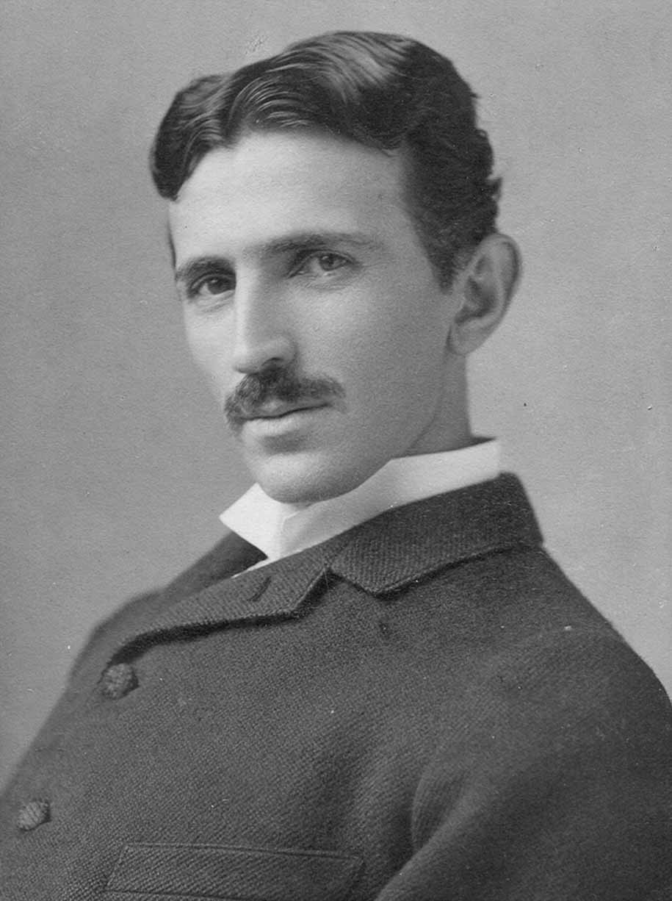
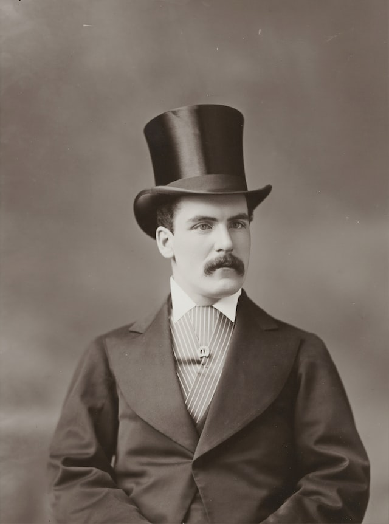
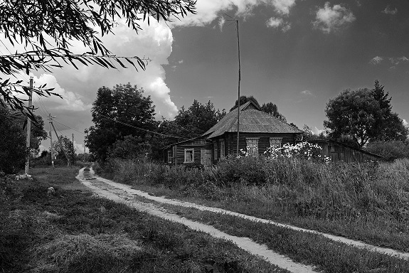
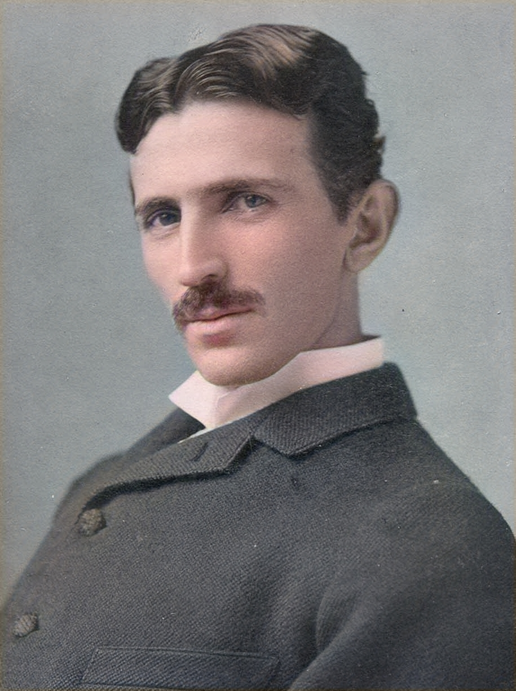
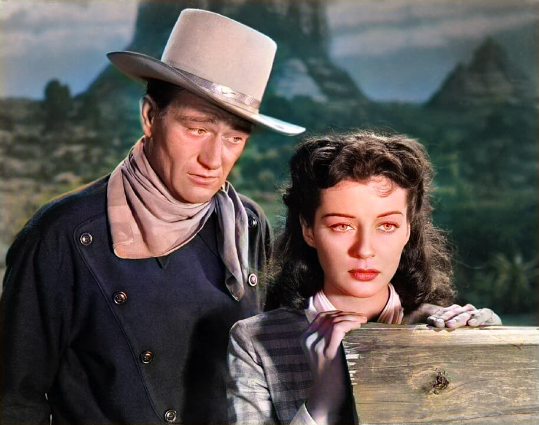
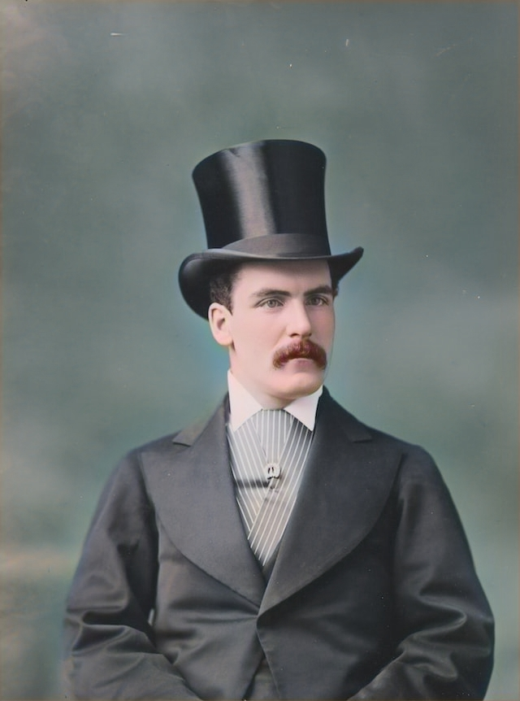
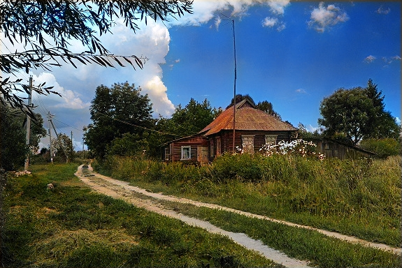
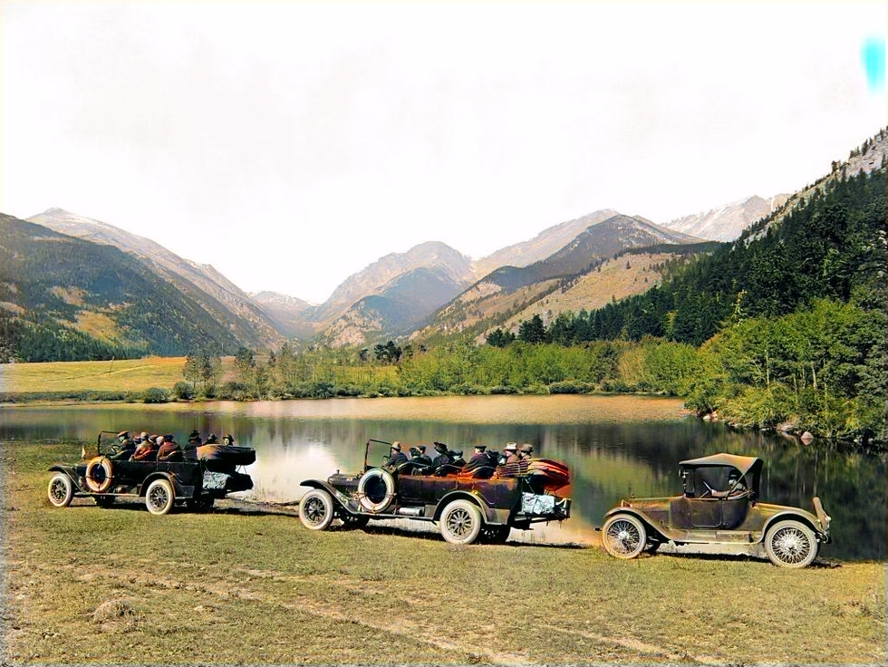

# DeOldifyEngine

*C# Net 7 implementation of Jason Antic's DeOldify(https://github.com/jantic/DeOldify)*

It's fork from https://github.com/ColorfulSoft/DeOldify.NET

To run you need download model data from
https://github.com/ColorfulSoft/DeOldify.NET/releases/tag/Weights

and copy it into **DeOldifyEngine/models**

**DeOldifyEngine** Runs on Windows and Linux

# Input black and white files

# Example color results

